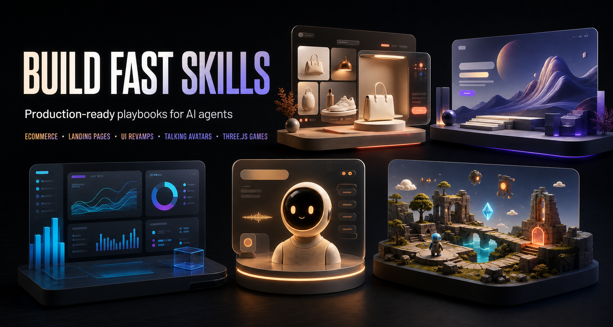

<div align="center">

# BuildFast Skills

### Your AI can write code. These skills teach it how to finish.

Five production-ready Agent Skills for building memorable websites, premium interfaces,
realtime avatars, and playable browser games from plain-language briefs.

<p>
  <a href="#skill-collection"></a>
  <a href="LICENSE"></a>
  <a href="#works-with-your-agent"></a>
</p>

[Explore the skills](#skill-collection) · [Install](#install-in-30-seconds) · [See the workflow](#how-buildfast-works) · [Browse the repository](#inside-the-repository)

</div>



<p align="center">
  <sub>One focused playbook for each outcome. Real implementation. Real verification.</sub>
</p>

---

## Why BuildFast?

An AI agent can generate a page in seconds. Getting to something coherent, useful, responsive, and actually finished is the hard part.

BuildFast Skills package the missing craft into repeatable workflows. Each skill gives your agent the decisions, reference material, starter assets, guardrails, and verification loop needed to ship a specific kind of product—not just another plausible-looking first draft.

> [!IMPORTANT]
> These are complete build playbooks, not prompt snippets. They work inside your existing project, respect the current stack, and define what “done” means before handoff.

## Install in 30 seconds

Install the collection and choose the skills you want:

```bash
npx skills@latest add https://github.com/buildfastwithai/buildfast-skills
```

Install one skill directly:

```bash
npx skills@latest add https://github.com/buildfastwithai/buildfast-skills \
  --skill premium-ui-revamp-skill
```

Add `--global` to use a skill across projects. Restart your agent after installation, then ask for the outcome in normal language.

```text
Use premium-ui-revamp-skill to redesign this dashboard.
Preserve every workflow and verify the result on desktop and mobile.
```

## Skill collection

| | Skill | Choose it when you need… | The finish line |
|:--:|:--|:--|:--|
| 🛍️ | **[Crazy Ecommerce Builder](crazy-ecommerce-builder-skill/)** | An unconventional, brand-specific storefront built from a loose product brief | Original visual direction, generated product imagery, responsive commerce UI, a usable cart, and a passing production build |
| 🎯 | **[Landing Page Generator](landing-page-generator-skill/)** | A campaign, launch, signup, promo, or lead-capture page designed to convert | One production-ready HTML file with focused copy, SEO metadata, CTA checks, and likely-speed audits |
| ✦ | **[Premium UI Revamp](premium-ui-revamp-skill/)** | A working interface that feels generic, dated, inconsistent, or visibly AI-generated | A product-specific redesign that preserves behavior and passes build, accessibility, and responsive checks |
| 🎙️ | **[Talking Avatar](talking-avatar-skill/)** | A realtime voice chatbot with a character created from a photo or description | A runnable app with safe session negotiation, identity-consistent assets, audio-driven mouth poses, and regression tests |
| 🎮 | **[Three.js Game Generator](threejs-game-generator-skill/)** | An original 3D browser game—or an unfinished Three.js scene that needs a real game loop | Controls, camera, states, feedback, audio, persistence, performance work, and a complete browser playthrough |

<details>
<summary><strong>Not sure which skill to choose?</strong></summary>

<br>

- Starting a store from a brand or product idea? Use **Crazy Ecommerce Builder**.
- Sending traffic to one focused page? Use **Landing Page Generator**.
- Improving a product that already works? Use **Premium UI Revamp**.
- Building a voice-driven character experience? Use **Talking Avatar**.
- Turning a game idea or Three.js scene into something playable? Use **Three.js Game Generator**.

</details>

## Built to produce, not just advise

| Commerce experience | Premium interface direction | Realtime avatar app |
|:--:|:--:|:--:|
|  |  |  |
| **Brand-specific storefront** | **Authored visual system** | **Audio-driven character** |

The storefront and avatar screenshots come from working Build Fast with AI examples. The interface image is an editorial direction board, included to show the quality and range of the visual system.

## How BuildFast works

| 01 — Brief | 02 — Build | 03 — Prove |
|:--|:--|:--|
| Describe the outcome, audience, constraints, and any existing project. The skill turns a loose request into a concrete build contract. | The agent follows a focused workflow and loads only the references, templates, scripts, or assets relevant to the job. | The skill closes the loop with builds, audits, browser checks, tests, or playthroughs—and reports any honest production limits. |

Every skill follows the same philosophy:

- **Specific over generic.** One clear job, one deliberate workflow, one measurable finish line.
- **Product truth over decoration.** Visual decisions come from the brand, audience, content, and use case.
- **Existing stack over needless migration.** Working routes, behavior, architecture, and conventions are preserved.
- **Verification over confidence.** The result is rendered, tested, audited, or played before it is called complete.
- **Honesty over simulation.** Missing providers, credentials, production services, and source content are surfaced clearly.

## Works with your agent

The collection uses the portable `SKILL.md` format and keeps every skill self-contained.

If your coding agent supports Agent Skills, use the installer above. Otherwise, copy a complete `*-skill` folder into the agent's skill directory. Keep the folder intact so linked `references/`, `scripts/`, and `assets/` remain available.

For agents without a skill system, attach the relevant `SKILL.md` and any files it links to, then ask the agent to follow that workflow.

> [!TIP]
> You do not need to memorize special commands. Mention the skill by name when you want explicit control, or simply describe the job and let a compatible agent match the request to the skill description.

## Inside the repository

```text
buildfast-skills/
├── assets/
│   └── readme/                         # collection artwork
├── crazy-ecommerce-builder-skill/
├── landing-page-generator-skill/
├── premium-ui-revamp-skill/
├── talking-avatar-skill/
├── threejs-game-generator-skill/
├── LICENSE
└── README.md
```

Each installable skill is a small, portable package:

```text
skill-name/
├── SKILL.md            # trigger, workflow, boundaries, and completion standard
├── README.md           # human-facing tour and examples
├── agents/             # optional agent UI metadata
├── references/         # deeper guidance loaded only when relevant
├── scripts/            # repeatable audits, validators, or generators
└── assets/             # starter files and README visuals
```

## What BuildFast will not fake

- Production checkout, inventory, email, analytics, hosting, or model access without the required provider and credentials.
- Testimonials, customer logos, performance claims, guarantees, or licensing details that were never supplied.
- A “successful” redesign that silently breaks existing product workflows.
- Lip sync driven by a decorative timer instead of the actual remote audio stream.
- A large framework or pretty scene presented as if it were a finished, playable game.

## Validate the collection locally

This repository intentionally contains no deployment or CI configuration. To confirm skill discovery and validate the bundled Python helpers:

```bash
npx skills@latest add . --list
python -m compileall -q landing-page-generator-skill/scripts
python -m compileall -q talking-avatar-skill/scripts
```

## Contributing

Ideas, improvements, and new outcome-focused skills are welcome. Open an [issue](https://github.com/buildfastwithai/buildfast-skills/issues/new) to propose a skill or a [pull request](https://github.com/buildfastwithai/buildfast-skills/pulls) to improve the collection.

When adding a skill, keep it focused: define one clear trigger, include only the resources it needs, establish an honest completion standard, and make verification part of the workflow.

## License

[MIT](LICENSE) © 2026 Build Fast with AI.

---

<p align="center">
  Built with care by <a href="https://www.buildfastwithai.com/"><strong>Build Fast with AI</strong></a>
  <br><br>
  <a href="https://github.com/buildfastwithai/buildfast-skills/issues/new">Request a skill</a>
  ·
  <a href="https://github.com/buildfastwithai/buildfast-skills">Star the collection</a>
</p>
