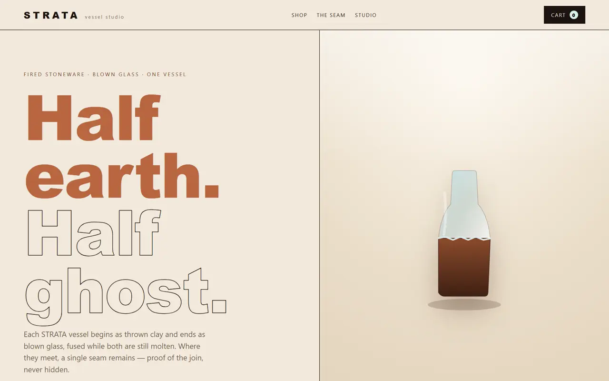
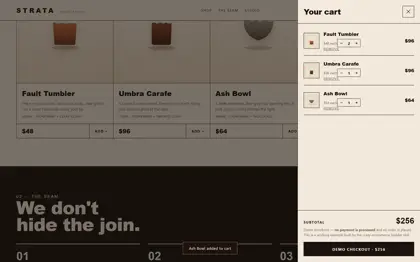
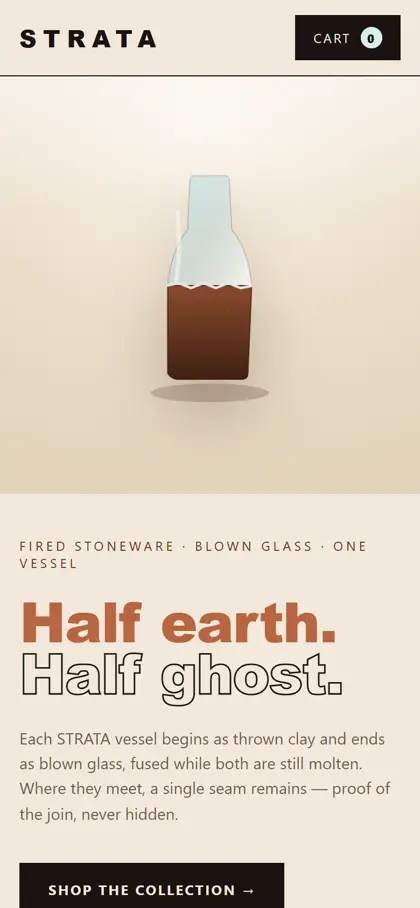

<div align="center">

# Crazy Ecommerce Builder

**Turn a short product brief into an unconventional storefront with a coherent creative thesis—not random effects.**

[Why it exists](#why-this-exists) · [What you get](#what-you-get) · [Use it](#use-it) · [Browse all skills](../README.md)

<br>

<code>npx skills add buildfastwithai/buildfast-skills --skill crazy-ecommerce-builder-skill</code>

</div>



<p align="center"><sub>STRATA, a working flagship example: one vessel, half fired stoneware and half blown glass.</sub></p>

---

## Why this exists

“Make it crazy” usually produces noise: oversized type, arbitrary motion, neon gradients, and a shop that is harder to use. This skill begins with the product truth, turns that tension into one visual world, and keeps the path from intrigue to purchase intact.

The result should feel impossible to swap onto an unrelated brand.

## What you get

- A written **creative thesis** tied to the product and customer feeling.
- A small, consistent **image system** instead of unrelated generated art.
- A responsive **commerce spine**: hero, browse surface, product clarity, cart state, brand proof, and honest demo states.
- Original direction without copying another store's brand, images, or distinctive composition.
- Production-build results plus a clear list of services that are not connected yet.

## See a store it builds

These are real screenshots from the [STRATA flagship example](https://github.com/buildfastwithai/crazy-ecommerce-builder/tree/main/examples/half-earth-half-ghost), captured at desktop and mobile sizes.

| Product family | Working cart | Mobile composition |
|:--:|:--:|:--:|
|  |  |  |

The cart includes quantity controls and an explicit demo-checkout note. The mobile view is composed image-first rather than merely stacking the desktop layout.

## Use it

```bash
npx skills add buildfastwithai/buildfast-skills --skill crazy-ecommerce-builder-skill
```

Then ask for the outcome:

> “Use crazy-ecommerce-builder-skill to turn this ceramic coffee brand into a bold storefront. Keep checkout clearly labeled as a demo.”

> “Rework my existing shop so it feels experimental and memorable without making it harder to buy.”

> “Create three art directions for this running-shoe launch, choose the strongest one, and build it.”

## Recipe

1. **Find the product tension.** Distill the brief into a customer feeling, visual world, commerce spine, and signature device.
2. **Choose one direction.** Test whether the thesis is specific, repeatable, usable, and rooted in what is being sold.
3. **Build one image world.** Keep camera, lighting, palette, materials, and product continuity coherent across the family.
4. **Make it shoppable.** Preserve product clarity, accessible controls, cart state, and mobile composition.
5. **Prove it.** Run the production build and inspect the first viewport, browse flow, cart, and responsive states.

## Bring

- A product or company brief, catalog details, audience, and brand constraints.
- An existing web project—or permission to create one in a suitable stack.
- Image generation for original product photography is strongly recommended.
- Real provider details for checkout, inventory, email, or fulfillment if those services must be live.

## What it will not do

- Decorate an ordinary template and call it an art direction.
- Hide the product behind a visual stunt.
- Copy a reference store's identity or distinctive assets.
- Pretend an unconnected checkout or operational service is production-ready.

## Inside the skill

```text
crazy-ecommerce-builder-skill/
├── SKILL.md
├── agents/openai.yaml
└── references/
    ├── commerce-checklist.md
    ├── creative-system.md
    └── image-system.md
```

The references separate creative direction, image continuity, and commerce usability so the agent loads only the detail needed for the current decision.

---

[← Browse BuildFast Skills](../README.md) · [MIT licensed](../LICENSE) · [View the standalone example](https://github.com/buildfastwithai/crazy-ecommerce-builder)
