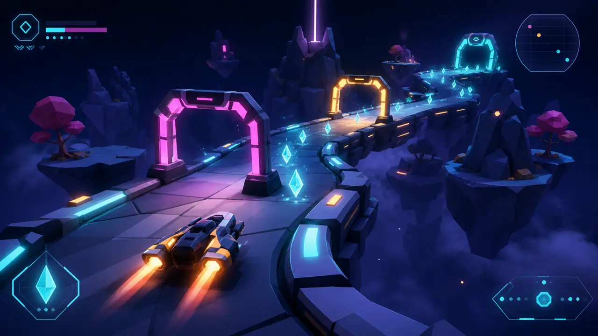

<div align="center">

# Three.js Game Generator

**Turn a game brief into an original, playable 3D browser game with a real loop, controls, UI states, audio, and verification.**

[Why it exists](#why-this-exists) · [What you get](#what-you-get) · [Use it](#use-it) · [Browse all skills](../README.md)

<br>

<code>npx skills add buildfastwithai/buildfast-skills --skill threejs-game-generator-skill</code>

</div>



<p align="center"><sub>Art-direction concept—not a screenshot of a bundled demo. The skill builds and verifies a playable game in your project.</sub></p>

---

## Why this exists

A rendered Three.js scene is not yet a game. A finished browser game needs a clear player verb, an objective, pressure, feedback, state transitions, controls that feel intentional, and a complete run from start to restart. This skill scopes for that finished loop before it adds secondary systems.

## What you get

- A maintainable game in the existing stack, or a lean Three.js + Vite project when no project exists.
- One complete core loop with camera, controls, objective, obstacle, feedback, and restart.
- Keyboard, pointer, and touch controls appropriate to the genre.
- DOM-based menus and HUD, pause/restart/game-over states, activated audio, and local persistence.
- An original mechanical and visual direction even when the brief references a familiar game.
- A successful production build plus browser, state-transition, and full-playthrough checks.

## Use it

```bash
npx skills add buildfastwithai/buildfast-skills --skill threejs-game-generator-skill
```

Then name the fantasy, player verb, scope, and target controls:

> “Use threejs-game-generator-skill to build a low-poly delivery game where the city folds upward as the timer runs out.”

> “Turn this Three.js scene into a complete three-minute arcade loop with mobile controls and a restart flow.”

> “Prototype an original third-person stealth game inspired by diorama theater sets—do not copy an existing title's characters or levels.”

## Recipe

1. **Write the game contract.** Define fantasy, core loop, completion, camera, controls, platform, and hard scope.
2. **Build a vertical slice.** Prove one player verb, objective, obstacle, feedback loop, and restart before expanding.
3. **Tune feel and camera together.** Movement, follow behavior, collision, and readable feedback are one system.
4. **Apply one world.** Use a coherent geometry, lighting, color, UI, and audio direction built for browser performance.
5. **Play the whole run.** Build, complete the game, restart it, resize, lose focus, test controls, and inspect busy-scene performance.

## Full-run proof

| Surface | Done means |
|:--|:--|
| **Loop** | A player can understand, play, win or lose, and restart without developer intervention |
| **State** | Menu, play, pause, completion, failure, and restart transitions behave correctly |
| **Input** | Required keyboard, pointer, and touch controls remain responsive and documented |
| **Runtime** | Console, asset loading, resize, focus loss, audio activation, and persistence are checked |
| **Build** | The production build succeeds and a busy scene remains playable |

## Bring

- A game brief, unfinished Three.js scene, or existing browser-game project.
- Node.js and npm.
- A browser with WebGL support.
- Licensed or original models, textures, fonts, and audio when external assets are needed.

## What it will not do

- Present a scene, engine skeleton, or menu as a finished game.
- Copy another title's characters, levels, or distinctive identity.
- Add large secondary systems before the vertical slice works.
- Claim playability without completing a real run and restart.

## Inside the skill

```text
threejs-game-generator-skill/
├── SKILL.md
├── agents/openai.yaml
└── references/
    ├── audio-recipes.md
    ├── engine-patterns.md
    ├── genres.md
    └── visuals.md
```

The references separate engine architecture, art direction, sound, and genre-specific decisions so the agent reads only what the current game needs.

---

[← Browse BuildFast Skills](../README.md) · [MIT licensed](../LICENSE) · [View the repository](https://github.com/buildfastwithai/buildfast-skills)
